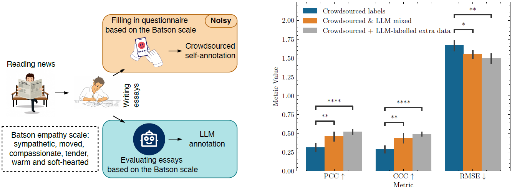

# Labels Generated by Large Language Models Help Measure People's Empathy _in Vitro_

<div align="center">
    
</div>

<div align="center">
    <a href="https://arxiv.org/abs/2501.00691">
        
    </a>
    <a href="https://arxiv.org/pdf/2501.00691">
        
    </a>
    <a href="https://github.com/hasan-rakibul/LLMPathy/stargazers">
        
    </a>
    <a href="https://github.com/hasan-rakibul/LLMPathy/network/members">
        
    </a>
    <a href="https://github.com/hasan-rakibul/LLMPathy/blob/main/LICENSE">
        
    </a>
</div>

**This repository is the official implementation of the paper [Labels Generated by Large Language Models Help Measure People's Empathy _in Vitro_](https://arxiv.org/abs/2501.00691).**

## To-do
- [ ] Make LLM-generated labels available in this repository.

## How to use

### Installation
This repository was tested on both `torch 2.2.0` on Python `3.12.3` and `torch 2.4.1` on Python `3.10.12`. All experiments with the RoBERTa PLM were conducted using `torch 2.4.1` with ROCm 6.1, which can be installed using `python -m pip install requirements_torch_rocm.txt` for AMD GPUs. All experiments with the DeBERTa PLM were conducted using `torch 2.2.0` with ROCm 5.7.3. 

The remaining packages can be installed using:
```bash
pip install -r requirements.txt
```

### Configurations
`config/` directory contains the configurations for the experiments. For example:
- `config/config_common.yaml` primarily includes configs that are common across train and test.
     - The pre-trained model is to be specified here.
     - The name of the columns to be supplied here to specify which one is LLM-generated and which one is the crowdsourced labels.
- `train_base.yaml` includes configs for the baseline experiments.


### Test
```bash
# configure the path in `config/config_test.yaml`
# e.g., set test_from_ckpts_parent_dir= logs/20241115_005338_y'(2024,2022)-ImprovedEarlyStop-MultiAlpha/lr_3e-05_bs_16/alpha_4.0`
# or test_from_checkpoint=/path/including/ckpt.ckpt
python src/test.py
```
- `job_test.sh` is a SLURM script, applicable for the Pawsey Setonix cluster.

### Logging
- y(202x, ...): baeline with crowdsourced (CS) labels (Table II)
- y'(202x, ...): 1st application scenario, where labels are modified based on alpha.
- y_llm(202x, ...): 2nd application scenario, where labels generated by LLM are used.

At most cases, combination of the above scenarios are used.
- y(202x)+y_llm(202y): 2nd application scenario. E.g., `logs/20241230_095259_y(2022)-y_llm(2024)-gpt` means NewsEmp24 + GPT-labelled NewsEmp22 (Table III)

## Citation
```bibtex
@misc{hasan2025labels,
      title={Labels Generated by Large Language Model Helps Measuring People's Empathy in Vitro}, 
      author={Md Rakibul Hasan and Yue Yao and Md Zakir Hossain and Aneesh Krishna and Imre Rudas and Shafin Rahman and Tom Gedeon},
      year={2025},
      eprint={2501.00691},
      archivePrefix={arXiv},
      primaryClass={cs.CL},
      url={https://arxiv.org/abs/2501.00691}, 
}
```