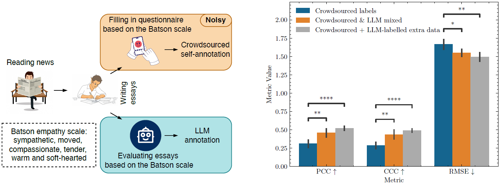
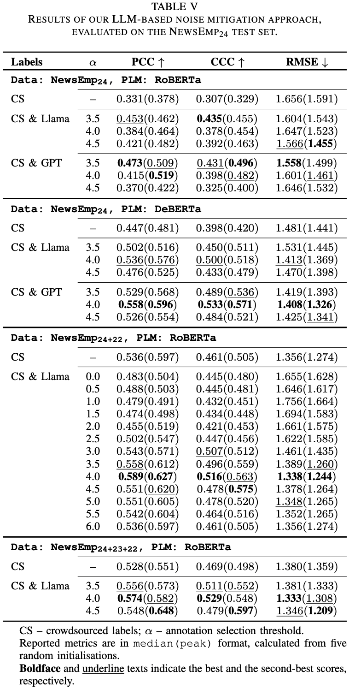
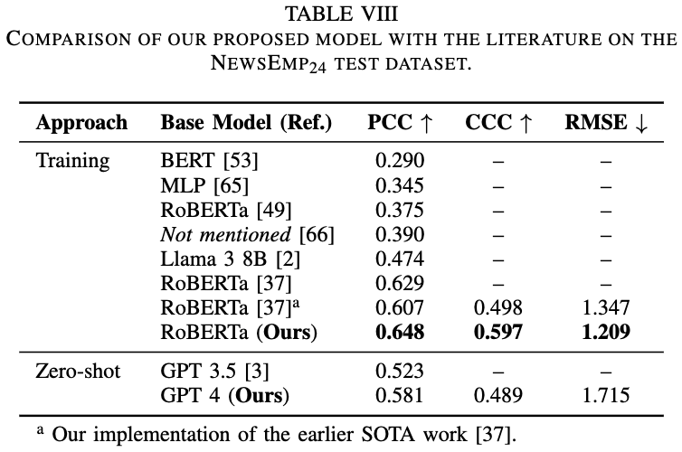

# Labels Generated by Large Language Models Help Measure People's Empathy in Vitro

**This repository is the official implementation of the above-mentioned paper, published in the _IEEE Journal of Selected Topics in Signal Processing (JSTSP)_.**

<div align="center">
    <a href=https://doi.org/10.1109/JSTSP.2026.3671186>
        
    </a>
    <a href="https://arxiv.org/abs/2501.00691">
        
    </a>
    <a href="https://hasan-rakibul.github.io/pdfs/hasan2026labels.pdf">
        
    </a>
    <a href="https://github.com/hasan-rakibul/LLMPathy/stargazers">
        
    </a>
    <a href="https://github.com/hasan-rakibul/LLMPathy/network/members">
        
    </a>
    <a href="https://github.com/hasan-rakibul/LLMPathy/blob/main/LICENSE">
        
    </a>
</div>

&nbsp;

<div align="center">
    
</div>

## Important update – _Our approach is even better than what we claimed in the published paper_
We discovered a few minor errors in reporting of the _peak_ RMSE scores (the minimum RMSE value selected from three runs), which affected Tables V and VIII of the published paper. The corrected tables are provided below, which shows our approach is even better than what we claimed in the published versions available on IEEE Xplore and arXiv.

<div align="center">
<p align="left">Table V shows that our noise mitigation approach outperforms the baseline across all experiment configurations: median and peak scores of PCCs, CCCs and RMSEs across <i>all four</i> data and PLM setups (some values on the last columns, which are inside () brackets, are updated):</p>
    
</div>

<div align="center">
&nbsp;
<p align="left">Table VIII shows that our approach outperforms Giorgi et al. [37]’s results in terms of <i>all three</i> evaluation metrics (two values in the last columns are updated):</p>
    
</div>

## LLM-generated labels

The LLM-generated labels used in our paper are available in the `data/llm-generated-labels` directory. Each file contains the generated labels together with the corresponding instance identifiers for the relevant dataset (e.g., message IDs, article IDs, speaker IDs, etc.).

Note that the public datasets we used restrict redistribution of the datasets, so we could not include the full datasets here in this repository. Instead, we provide the LLM-generated labels aligned with the original dataset IDs, so they can be easily matched back to the source data.

The original datasets can be obtained from:
- [NewsEmp22 dataset](https://codalab.lisn.upsaclay.fr/competitions/834#learn_the_details-datasets)
- [NewsEmp23 dataset](https://codalab.lisn.upsaclay.fr/competitions/11167#learn_the_details-datasets)
- [NewsEmp24 dataset](https://codalab.lisn.upsaclay.fr/competitions/18810#learn_the_details-datasets)

## How to use this repository

### Installation
This repository was built and tested on both `torch 2.2.0` on Python `3.10.12` and `torch 2.4.1` on Python `3.12.3`. All experiments with the RoBERTa PLM were conducted using `torch 2.4.1` with ROCm 6.1, which can be installed using `python -m pip install requirements_torch_rocm.txt` for AMD GPUs. All experiments with the DeBERTa PLM were conducted using `torch 2.2.0` with ROCm 5.7.3. 

The remaining packages can be installed using:
```bash
pip install -r requirements.txt
```

### Configurations
`config/` directory contains the configurations for the experiments. For example:
- `config/config_common.yaml` primarily includes configs that are common across train and test.
     - The pre-trained model is to be specified here.
     - The name of the columns to be supplied here to specify which one is LLM-generated and which one is the crowdsourced labels.
- `train_base.yaml` includes configs for the baseline experiments.


### Test
```bash
# configure the path in `config/config_test.yaml`
# e.g., set test_from_ckpts_parent_dir= logs/20241115_005338_y'(2024,2022)-ImprovedEarlyStop-MultiAlpha/lr_3e-05_bs_16/alpha_4.0`
# or test_from_checkpoint=/path/including/ckpt.ckpt
python src/test.py
```
- `job_test.sh` is a SLURM script, applicable for the Pawsey Setonix cluster.

### Logging
- y(202x, ...): baeline with crowdsourced (CS) labels (Table II)
- y'(202x, ...): 1st application scenario, where labels are modified based on alpha.
- y_llm(202x, ...): 2nd application scenario, where labels generated by LLM are used.

At most cases, combination of the above scenarios are used.
- y(202x)+y_llm(202y): 2nd application scenario. E.g., `logs/20241230_095259_y(2022)-y_llm(2024)-gpt` means NewsEmp24 + GPT-labelled NewsEmp22 (Table III)


## Citation
```bibtex
@article{hasan2026labels,
    author={Hasan, Md Rakibul and Yao, Yue and Hossain, Md Zakir and Krishna, Aneesh and Rudas, Imre and Rahman, Shafin and Gedeon, Tom},
    journal={IEEE Journal of Selected Topics in Signal Processing}, 
    title={Labels Generated by Large Language Models Help Measure People's Empathy in Vitro}, 
    year={2026},
    volume={},
    number={},
    pages={1-14},
    doi={10.1109/JSTSP.2026.3671186}
}
```